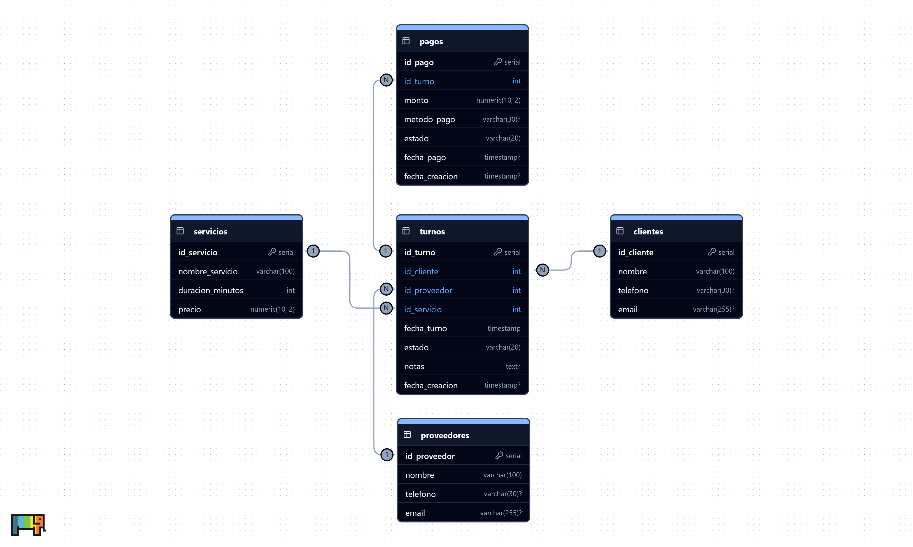

## Proyecto Integrador Python

- **Grupo:** Bitwars
- **Integrantes:** Francesco Cornachione, Tomás Vilche, Pablo García, Valentín Castillo

---

### Requerimientos

- Proyecto nuevo o anterior
- Incluir base de datos (SQL o NoSQL)
- Video máximo 30 minutos donde todos participen
- Subido en el repositorio

**Fecha de entrega:** 30 de Junio

---

## Sistema de turnos

Para nuestra aplicación, creamos un sistema de gestión de turnos, orientado a cualquier negocio que necesite gestionar turnos con sus clientes (consultorio médico, veterinarias, peluquerías, estudios jurídicos, etc).

#### Funciones:

- **Reservar turnos:** Los clientes pueden reservar un turno según los horarios disponibles del vendedor / negocio.
- **Cancelar turnos:** Los clientes pueden cancelar un turno previamente reservado
- **Ver agenda de turnos:** El vendedor / negocio puede ver qué turnos fueron reservados, cancelados o actualizados.
- Confirmación de turno en PDF: Una vez reservado el turno, el cliente puede elegir si descargar un comprobante en formato PDF con los detalles de su turno.
- **Exportar turnos a .csv / .xlsx.**
- **Importar turnos desde archivos .csv / .xlsx:** Estará disponible en una versión a futuro.

#### Stack técnico:

- **PostgreSQL:** Base de datos relacional para almacenar las tablas necesarias.
- **Psycopg2:** Librería de Python para trabajar con PostgreSQL.
- **Polars:** Librería de Python para manejo de dataframes, utilizada para exportar turnos en formato .csv o .xlsx (Excel).
- **CustomTkinter:** Librería de Python para creación de interfaces, utilizada para la interfaz de usuario de la aplicación.

#### Estructura del proyecto

```
appointment-management-system/
│
├── data/
│   ├── exports/
│   └── imports/
│
├── logs/
│   └── app.log
│
├── sql/
│   └── schema.sql
│
├── src/
│   ├── assets/
│   │   ├── icons/
│   │   └── images/
│   │
│   ├── config/
│   │   ├── database.py
│   │   ├── logger.py
│   │   └── settings.py
│   │
│   ├── import_export/
│   │   ├── csv_exporter.py
│   │   └── csv_importer.py
│   │
│   ├── repositories/
│   │   ├── clientes.py
│   │   ├── proveedores.py
│   │   ├── servicios.py
│   │   ├── turnos.py
│   │   └── pagos.py
│   │
│   ├── utils/
│   │   ├── validators.py
│   │   ├── date_utils.py
│   │   └── constants.py
│   │
│   └── ui/
│       ├── main.py
│       ├── clientes_view.py
│       ├── proveedores_view.py
│       ├── servicios_view.py
│       ├── turnos_view.py
│       ├── pagos_view.py
│       └── widgets/
│           └── ...
│
├── .env
├── README.md
├── requirements.txt
└── diagrama_entidad_relacion.png
```

- **data:** Carpeta para guardar imports y exports de archivos csv, excel y PDF
- **logs:** Carpeta para guardar los logs de la aplicación
- **sql:** Scripts SQL
- **src:** Código fuente de la aplicación
- **assets:** Elementos (imágenes, íconos) de la interfaz
- **config:** Configuración de la aplicación y la base de datos
- **repositories:** Objetos que interactúan con la base de datos
- **ui:** Interfaz de la aplicación

---


#### Diagrama Entidad-Relación



---

# Estructura de la Base de Datos

## Tabla: `usuarios`

Almacena la información de las personas que utilizan el sistema para reservar turnos.

Un usuario puede tener el rol de `CLIENTE` o `ADMIN`.

### Campos

| Campo | Descripción |
|-------|-------------|
| `id_usuario` | Identificador único del usuario. |
| `nombre` | Nombre completo del usuario. |
| `telefono` | Número de teléfono de contacto. |
| `email` | Correo electrónico del usuario. |
| `password_hash` | Contraseña almacenada de forma segura mediante hashing. |
| `rol` | Rol del usuario dentro del sistema. |
| `fecha_creacion` | Fecha de creación de la cuenta. |

### Roles posibles

| Rol | Descripción |
|-----|-------------|
| `CLIENTE` | Puede reservar y administrar sus propios turnos. |
| `ADMIN` | Puede administrar proveedores, servicios, turnos y pagos. |

### Ejemplo

| id_usuario | nombre | telefono | email | rol |
|------------|--------|----------|-------|-----|
| 1 | Juan Pérez | 2611234567 | juan@email.com | CLIENTE |

---

## Tabla: `proveedores`

Almacena la información de los profesionales o prestadores de servicios que atienden los turnos.

### Campos

| Campo | Descripción |
|-------|-------------|
| `id_proveedor` | Identificador único del proveedor. |
| `nombre` | Nombre completo del proveedor. |
| `telefono` | Número de teléfono de contacto. |
| `email` | Correo electrónico del proveedor. |

### Ejemplo

| `id_proveedor` | `nombre` |
|----------------|----------|
| 1 | Dr. Carlos Gómez |
| 2 | Sofía Martínez |

---

## Tabla: `servicios`

Define los servicios que pueden reservarse dentro del sistema.

### Campos

| Campo | Descripción |
|-------|-------------|
| `id_servicio` | Identificador único del servicio. |
| `nombre_servicio` | Nombre del servicio ofrecido. |
| `duracion_minutos` | Duración estimada del servicio en minutos. |
| `precio` | Precio del servicio. |

### Ejemplo

| `id_servicio` | `nombre_servicio` | `duracion_minutos` | `precio` |
|---------------|-------------------|--------------------|----------|
| 1 | Consulta Inicial | 60 | 15000 |
| 2 | Corte de Pelo | 30 | 8000 |

---

## Tabla: `turnos`

Representa cada reserva realizada por un usuario.

Relaciona un usuario, un proveedor y un servicio en una fecha y hora determinadas.

### Campos

| Campo | Descripción |
|-------|-------------|
| `id_turno` | Identificador único del turno. |
| `id_usuario` | Usuario que reserva el turno. |
| `id_proveedor` | Profesional que brindará el servicio. |
| `id_servicio` | Servicio solicitado. |
| `fecha_turno` | Fecha y hora programadas para el turno. |
| `estado` | Estado actual del turno. |
| `notas` | Observaciones adicionales. |
| `fecha_creacion` | Fecha de creación del registro. |

### Estados posibles

| Estado | Descripción |
|--------|-------------|
| `PENDIENTE` | Turno creado pero aún no confirmado. |
| `CONFIRMADO` | Turno confirmado. |
| `COMPLETADO` | Servicio realizado exitosamente. |
| `CANCELADO` | Turno cancelado. |
| `NO_ASISTIO` | El usuario no se presentó al turno. |

### Ejemplo

| `id_turno` | `usuario` | `proveedor` | `servicio` | `fecha` |
|------------|-----------|-------------|-------------|---------|
| 1 | Juan Pérez | Carlos Gómez | Consulta Inicial | 2026-06-20 15:30 |

---

## Tabla: `pagos`

Almacena la información relacionada con los pagos de los turnos.

Cada pago está asociado a un turno específico.

### Campos

| Campo | Descripción |
|-------|-------------|
| `id_pago` | Identificador único del pago. |
| `id_turno` | Turno asociado al pago. |
| `monto` | Importe abonado. |
| `metodo_pago` | Método utilizado para pagar. |
| `estado` | Estado actual del pago. |
| `fecha_pago` | Fecha en que se realizó el pago. |
| `fecha_creacion` | Fecha de creación del registro. |

### Estados posibles

| Estado | Descripción |
|--------|-------------|
| `PENDIENTE` | Pago aún no realizado. |
| `PAGADO` | Pago completado. |
| `REEMBOLSADO` | Pago devuelto al usuario. |

### Métodos de pago posibles

* Efectivo
* Tarjeta de crédito
* Tarjeta de débito
* Transferencia bancaria

### Ejemplo

| `id_pago` | `id_turno` | `monto` | `estado` |
|-----------|------------|---------|----------|
| 1 | 1 | 15000 | PAGADO |

---

### Ejecutar aplicación

1. Clonar repositorio

   ```bash
   git clone 
   ```
2. Instalar requisitos

   ```bash
   pip install requirements.txt
   ```
